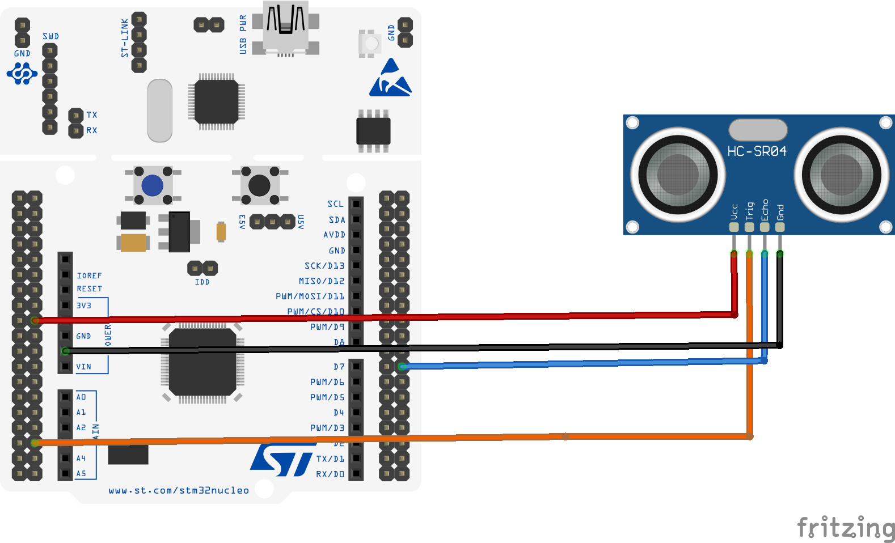

# HC-SR04 Ultrasonic Distance Sensor : STM32 Nucleo-F446RE

Bare-metal (register-level) driver for the HC-SR04 ultrasonic distance sensor, using polling with a hardware timer (TIM2) as an accurate microsecond stopwatch. Part of the v1 autonomous robot build   obstacle detection stage.

## How It Works

1. Send a 10µs HIGH pulse on **TRIG**
2. The sensor emits an ultrasonic burst and raises **ECHO** high
3. **ECHO** stays high for exactly as long as the sound takes to travel to an object and back
4. Distance (cm) = echo pulse duration (µs) / 58

## Pin Connections

| HC-SR04 Pin | Nucleo Pin | Function |
|-------------|------------|----------|
| VCC         | 5V         | Power (HC-SR04 requires 5V, not 3.3V) |
| GND         | GND        | Ground |
| TRIG        | PB0        | GPIO output — trigger pulse |
| ECHO        | PB1        | GPIO input — echo pulse (**via voltage divider**) |

## Wiring Diagram

